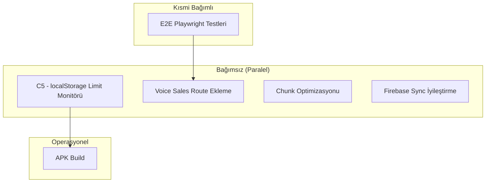

# PARSPEL v3.32.2 — Paralel İcra Planı

> Oluşturulma: 20 Haziran 2026
> Kapsam: 6 madde, paralel agent koordinasyonu
> Plan: ÖNCE PLAN → SONRA İCRA

---

## Görev Dağılımı ve Bağımlılıklar



**Paralel çalıştırma (4 agent aynı anda):**
- Agent 1 → T1 (C5) + T3 (Chunk) 
- Agent 2 → T2 (Voice Route) + T5 (E2E)
- Agent 3 → T4 (Firebase Sync)
- Agent 4 → T6 (APK Build — bağımlı değil, ayrı çalışır)

---

## T1 — C5: localStorage Limit Monitörü

### Durum Tespiti
- Mevcut: `dataIntegrityChecker.ts` pasif check (sadece integrity scan'de)
- Mevcut: `safeIO.ts` quota hatası yakalama + eviction
- Eksik: **Gerçek zamanlı UI bildirimi**, proaktif boyut göstergesi

### Yapılacaklar
1. `src/lib/db/storageMonitor.ts` — yeni dosya
   - `getStorageUsage()` → { usageBytes, usageMB, percentage, remainingMB }
   - `checkStorageHealth()` → dönüş tipi: `'ok' | 'warning' | 'critical'`
   - Eşikler: warning @ 4MB, critical @ 4.5MB (5MB limit)
   - Her `saveToStorage` sonrası otomatik check (debounced)
2. `src/hooks/useStorageMonitor.ts` — yeni hook
   - `useStorageMonitor(db)` → { usage, status, lastChecked }
   - Toast bildirimi: warning → sarı toast, critical → kırmızı toast (günde 1 kez)
3. Test: `src/lib/db/storageMonitor.test.ts`
   - Mock localStorage ile boyut hesaplama
   - Eşik geçiş testleri

### Etkilenen Dosyalar
| Dosya | İşlem |
|-------|-------|
| `src/lib/db/storageMonitor.ts` | ✨ YENİ |
| `src/hooks/useStorageMonitor.ts` | ✨ YENİ |
| `src/lib/db/storageMonitor.test.ts` | ✨ YENİ |
| `src/lib/db/storage.ts` | 🔧 saveToStorage sonuna checkStorageHealth çağrısı |

### Tahmin: ~2 saat

---

## T2 — Voice Sales Route Ekleme

### Durum Tespiti
- Voice-sales feature tamamen bağımsız çalışıyor (speech/parser/executor/ui)
- `VoiceSaleButton.tsx` mevcut ama hiçbir sayfaya bağlı değil
- `PLAN.md`'de `src/pages/SesliSatis.tsx` öngörülmüş ama yok
- `App.tsx`'de route yok

### Yapılacaklar
1. `src/pages/SesliSatis.tsx` — yeni sayfa
   - Route: `/sesli-satis`
   - `<VoiceSaleButton>` bileşenini sayfaya yerleştir
   - `onSaleComplete` → `/sales`'e yönlendir + toast
   - Minimal wrapper (~50 satır), tüm iş VoiceSaleButton'da
2. `src/App.tsx` — route ekle
   - `const SesliSatis = lazy(() => import('@/pages/SesliSatis'));`
   - `<Route path="/sesli-satis"><SesliSatis db={db} save={save} /></Route>`
3. Navigasyon: `Sales.tsx`'e "Sesli Satış" butonu
   - `setLocation('/sesli-satis')` ile yönlendirme
   - İsteğe bağlı: sidebar'a ekleme

### Etkilenen Dosyalar
| Dosya | İşlem |
|-------|-------|
| `src/pages/SesliSatis.tsx` | ✨ YENİ |
| `src/App.tsx` | 🔧 Route + lazy import ekle |
| `src/pages/Sales.tsx` | 🔧 "Sesli Satış" butonu ekle (opsiyonel) |

### Tahmin: ~1 saat

---

## T3 — Chunk Optimizasyonu

### Durum Tespiti
- Mevcut `vite-manual-chunks.ts`: 11 chunk (vendor, capacitor, radix, charts, animations, icons, firebase, excel, exceljs, dexie, state)
- Build çıktısı: index 234KB, vendor 244KB, charts 382KB, firebase 157KB, exceljs 424KB
- `chunkSizeWarningLimit: 500` KB
- **Sorun:** charts (382KB) ve exceljs (424KB) chunk'ları büyük, ama zaten lazy

### Yapılacaklar
1. **Lazy loading denetimi** — tüm route'ların lazy import ile sarıldığını doğrula
2. **charts chunk** → recharts'ın tree-shake edilemeyen kısımları var mı kontrol
3. **firebase chunk** → sadece kullanılan modülleri import et (firestore, auth, functions)
4. **vendor chunk** → React 19 + react-dom ~200KB normal, ama React-Router(wouter) hafif
5. **`chunkSizeWarningLimit`** → 500 → 450KB düşür (daha sıkı budget)
6. **Build testi** → `pnpm run build` ile chunk boyutlarını doğrula

### Etkilenen Dosyalar
| Dosya | İşlem |
|-------|-------|
| `src/lib/vite-manual-chunks.ts` | 🔧 Küçük düzeltmeler (opsiyonel) |
| `vite.config.ts` | 🔧 chunkSizeWarningLimit 500→450 |
| Firebase import'ları | 🔧 Sadece kullanılan modüllere daralt |

### Tahmin: ~2 saat

---

## T4 — Firebase Sync İyileştirme

### Durum Tespiti
- **Conflict resolution:** `loadFromFirebase` sadece `cloudDb._version > db._version` kontrolü yapar — field-level merge yok
- **Retry:** 3 deneme, exponential backoff var (2s/4s/8s)
- **Error handling:** Hata durumunda sadece log + emitSync("error")
- **Last-write-wins:** Çakışma durumunda son yazan kazanır, merge yok

### Yapılacaklar
1. **Field-level conflict resolution**
   - `sync.ts`'ye `mergeDB(local: DB, remote: DB): DB` fonksiyonu
   - Her array için timestamp bazlı merge: `updatedAt`'e göre son değişen kazansın
   - `_version` karşılaştırması + array-level merge
2. **Retry iyileştirme**
   - Retry'ler arasına jitter ekle (±500ms random)
   - `MAX_RETRIES = 3` → `5` (daha dayanıklı)
   - `RETRY_DELAYS = [2000, 4000, 8000]` → `[1000, 2000, 4000, 8000, 16000]`
3. **Conflict UI bildirimi**
   - `sync.ts`'de conflict durumunda emitSync("conflict", ...)
   - `useDBSync`'de conflict toast'u
4. **Test:** `sync.test.ts`'ye conflict resolution testleri ekle

### Etkilenen Dosyalar
| Dosya | İşlem |
|-------|-------|
| `src/hooks/db/sync.ts` | 🔧 mergeDB fonksiyonu + retry iyileştirme |
| `src/hooks/db/sync.test.ts` | 🔧 Conflict resolution testleri |
| `src/hooks/db/useDBSync.ts` | 🔧 Conflict bildirimi |

### Tahmin: ~4 saat

---

## T5 — E2E Playwright Testleri

### Durum Tespiti
- Mevcut: 7 spec dosyası (smoke, accessibility, comprehensive-audit, example, finance, inventory, sales)
- Eksik: voice-sales E2E, cari workflow, settings, error scenarios
- Playwright config tam, `pnpm exec playwright test` çalışıyor

### Yapılacaklar
1. **Voice sales E2E** — `e2e/voice-sales.spec.ts`
   - Sesli satış sayfası açma
   - VoiceSaleButton render kontrolü
   - Speech recognition mock (Web Speech API mock)
2. **Cari workflow** — `e2e/cari.spec.ts`
   - Cari ekleme, düzenleme, silme
   - Cari'ye satış yapma
   - Bakiye görüntüleme
3. **Settings workflow** — `e2e/settings.spec.ts`
   - Arayüz ayarları değiştirme
   - Bağlantı ayarları
   - Yedekleme/geri yükleme
4. **Error scenarios** — `e2e/errors.spec.ts`
   - 404 sayfası
   - Geçersiz route
   - Boş veri durumları

### Etkilenen Dosyalar
| Dosya | İşlem |
|-------|-------|
| `e2e/voice-sales.spec.ts` | ✨ YENİ |
| `e2e/cari.spec.ts` | ✨ YENİ |
| `e2e/settings.spec.ts` | ✨ YENİ |
| `e2e/errors.spec.ts` | ✨ YENİ |

### Tahmin: ~6 saat

---

## T6 — APK Build

### Durum Tespiti
- Capacitor config mevcut (`capacitor.config.ts`)
- Android manifest/platform mevcut mu? Bilinmiyor.
- GitHub workflow: `.github/workflows/build-apk.yml`
- `pnpm run build` → dist/ → `npx cap sync` → `npx cap open android`

### Yapılacaklar
1. `pnpm run build` — production build al
2. Android platform kontrolü:
   - `npx cap sync android` — web assets'i Android projesine kopyala
   - Android platform yoksa: `npx cap add android`
3. APK build:
   - `cd android && ./gradlew assembleDebug` (veya `npx cap build android`)
   - Çıktı: `android/app/build/outputs/apk/debug/app-debug.apk`
4. Build çıktısını doğrula

### Etkilenen Dosyalar
| Dosya | İşlem |
|-------|-------|
| `capacitor.config.ts` | 🔧 (opsiyonel) versionCode/versionName güncelle |
| GitHub Actions | 🔧 (opsiyonel) workflow iyileştirme |

### Tahmin: ~1 saat (build süresi ~3dk)

---

## İcra Sırası

```
1. Paralel Agent Çalıştır:
   ├── Agent A: C5 (storageMonitor) + T3 (Chunk)
   ├── Agent B: T2 (Voice Route) + T5 (E2E)
   ├── Agent C: T4 (Firebase Sync)
   └── Agent D: T6 (APK Build)
   
2. Bekle → Tüm agent'lar bitsin

3. Doğrula:
   ├── lint
   ├── typecheck
   ├── test:run
   ├── build
   └── playwright test
   
4. Changelog + package.json + state-registry güncelle

5. Commit + Push
```

## Toplam Tahmin: ~16 saat (paralel → ~6 saat wall-clock)
