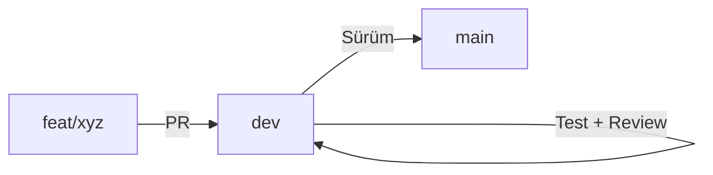

# Geliştirme İş Akışı

## Branch Stratejisi

```
main (production)
  └── dev (development)
        ├── feat/yeni-ozellik
        ├── fix/hata-duzeltme
        ├── chore/bakim
        └── refactor/yeniden-duzenleme
```

- `main` — Kararlı sürüm, production'a hazır
- `dev` — Geliştirme merkezi, tüm PR'lar buraya
- `feat/*` — Yeni özellik branch'leri
- `fix/*` — Hata düzeltme branch'leri
- `chore/*` — Bakım, bağımlılık, yapılandırma
- `refactor/*` — Kod yeniden düzenleme

## Günlük İş Akışı



### 1. Yeni bir branch oluştur

```bash
git checkout dev
git pull origin dev
git checkout -b feat/ekledigim-ozellik
```

### 2. Geliştirme yap

```bash
# Kod yaz, test ekle
pnpm run dev              # Geliştirme sunucusu
pnpm run test:run         # Testleri çalıştır
pnpm run typecheck        # Tip kontrolü
```

### 3. Commit hazırlığı

```bash
git add .
# pre-commit hook'u otomatik çalışır:
#   - lock file senkronizasyonu
#   - typecheck
#   - eslint + prettier
#   - JSON validasyonu
#   - changelog kontrolü
git commit -m "feat(ui): Yeni buton eklendi"
```

### 4. Commit mesajı kuralları

```
feat(scope): Kısa açıklama (8-72 karakter)

Uzun açıklama (opsiyonel):
- Ne yapıldı
- Neden yapıldı
- Breaking change varsa belirt

Closes #123
```

### 5. Push

```bash
git push origin feat/ekledigim-ozellik
# pre-push hook'u otomatik çalışır:
#   - test suite
#   - build
#   - spec compliance
#   - bundle size
```

### 6. Pull Request

1. GitHub'da PR aç: `feat/xyz` → `dev`
2. PR template'ini doldur
3. CI pipeline'ı bekle:
   ```
   lint → typecheck → test:run → build
   ```
4. En az 1 onay al
5. Merge et

## CI Pipeline (Zorunlu Sıra)

```bash
pnpm run lint       # ESLint (max 100 warning)
pnpm run typecheck  # TypeScript --noEmit
pnpm run test:run   # Vitest + fast-check
pnpm run build      # Vite production build
```

## Önemli Kurallar

### Changelog
Her kaynak kodu değişikliğinde `src/lib/changelog.ts` güncellenmeli. Pre-commit hook'u bunu kontrol eder.

### Veri Katmanı
- Asla doğrudan `localStorage`'a yazma — `save()`/`saveGuarded()`/`saveWithLog()` kullan
- `prevDB → işlem → nextDB` pattern'i

### Test
- Birim testler: `src/lib/*.test.ts` (co-located)
- Entegrasyon: `src/__tests__/`
- E2E: `e2e/*.spec.ts` (Playwright)
- Pattern: pure functions, UI bağımlılığı yok

## Sık Yapılan Hatalar

| Hata | Çözüm |
|------|-------|
| `changelog.ts` güncellenmemiş | `src/lib/changelog.ts`'ye not ekle |
| `localStorage.clear is not a function` | jsdom hatası, `try/catch` kullan |
| `EACCES: permission denied` | `node_modules`'i sil, `pnpm install` |
| `pnpm-lock.yaml` güncel değil | `pnpm install --no-frozen-lockfile` |
